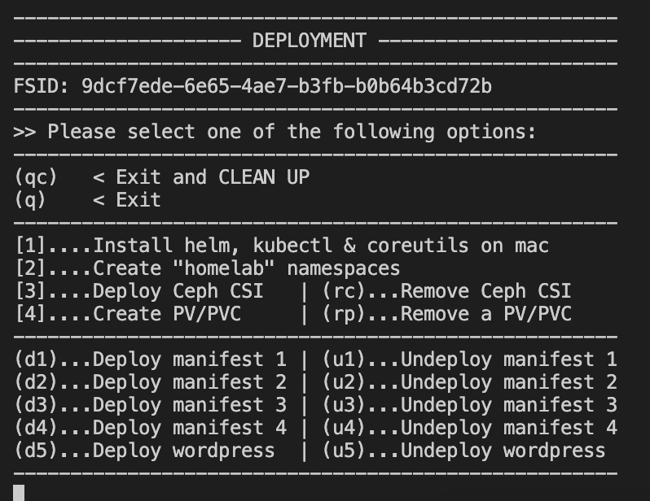

# ON YOUR MAC RUN:

```bash
wget https://raw.githubusercontent.com/alrokayan/proxmox-ceph-k3s/main/pve-ceph-k3s.sh && chmod +x pve-ceph-k3s.sh && ./pve-ceph-k3s.sh
```


# SCREENS:
## Main Menu


## Infrastracture Menu


## Storage Menu


## Deployment Menu


